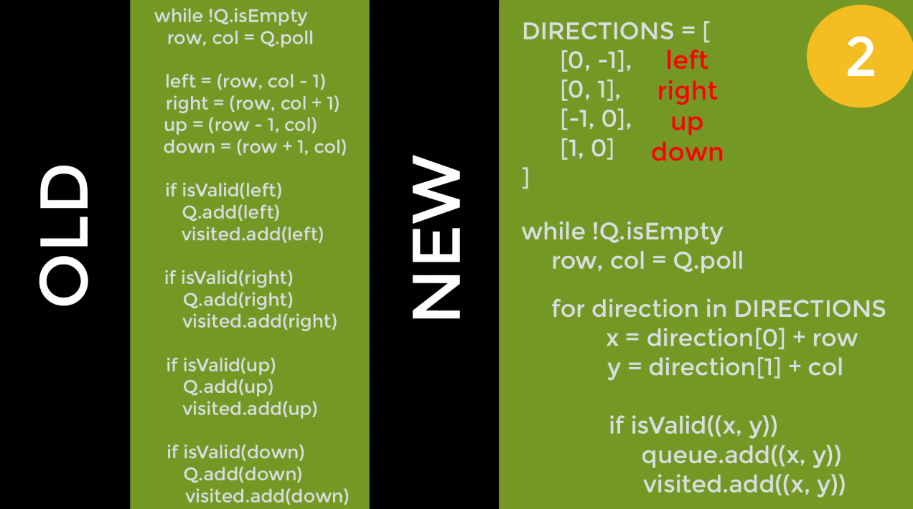

# Graph

- Three types of graphs: undirected graphs, directed graphs, and weighted graphs.
- Some ideas:
  - Path:
    - the sequence of vertices to go through from one vertex to another. In Figure 1, a path from A to C is [A, B, C], or [A, G, B, C], or [A, E, F, D, B, C].
      > **Note**: there can be multiple paths between two vertices.
  - Negative Weight Cycle:
    - In a “weighted graph”, if the sum of the weights of all edges of a cycle is a negative value, it is a negative weight cycle. In Figure 4, the sum of weights is -3.
  - Connectivity:
    - if there exists at least one path between two vertices, these two vertices are connected. In Figure 1, A and C are connected because there is at least one path connecting them.
  - Degree of a Vertex:
    - the term “degree” applies to unweighted graphs. The degree of a vertex is the number of edges connecting the vertex. In Figure 1, the degree of vertex A is 3 because three edges are connecting it.
  - In-Degree:
    - “in-degree” is a concept in directed graphs. If the in-degree of a vertex is d, there are d directional edges incident to the vertex. In Figure 2, A’s indegree is 1, i.e., the edge from F to A.
  - Out-Degree:
    - “out-degree” is a concept in directed graphs. If the out-degree of a vertex is d, there are d edges incident from the vertex. In Figure 2, A’s outdegree is 3, i,e, the edges A to B, A to C, and A to G.

## BFS

Vertices = numbers
Edges = index neighbors

- Queue:

### Easy way to represent node:

1. class Coord: x, y
2. String "x,y"

- problem: hard to coordinate from string to integer back to coordinates

3. Array [x,y]
   - writing a lot of codes
4. Integer Representation
   x,y -> z

```
    Queue[1 5]
    2D -> 1D
    X* COLS + Y
    columns = 3
    x,y = (0,1) = 0*3 + 1 = 1

    convert the integer back to the coordinate
    1D to 2D
    row = index/cols,
    col = index % cols
```

## Simplifying BFS algo

look up, down left, right for every single vertices


## User input as the visited set

func solve (int[][] matrix)
