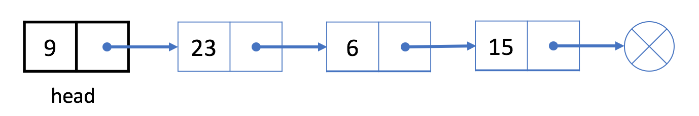
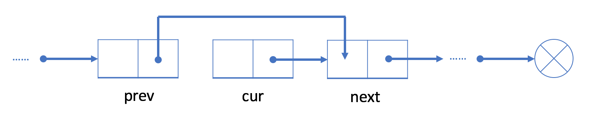

# LinkedList

Similar to the array, the linked list is also a linear data structure.

As you can see, each element in the linked list is actually a separate object while all the objects are linked together by the reference field in each element.

There are two types of linked list: singly linked list and doubly linked list.

### Here is the typical definition of a node in a singly-linked list:

```java
// Definition for singly-linked list.
public class SinglyListNode {
    int val;
    SinglyListNode next;
    SinglyListNode(int x) { val = x; }
}
```

## Add operation

If we want to add a new value after a given node prev, we should:

1. Initialize a new node cur with the given value;
2. Link the "next" field of cur to prev's next node next;
3. Link the "next" field in prev to cur.

Unlike an array, we don’t need to move all elements past the inserted element. Therefore, you can insert a new node into a linked list in O(1) time complexity, which is very efficient.

For instance,

Let's insert a new value 9 after the second node 6.

We will first initialize a new node with value 9. Then link node 9 to node 15. Finally, link node 6 to node 9.

After insertion, our linked list will look like this:


## Add a Node at the Beginning

As we know, we use the head node head to represent the whole list.

So it is essential to update head when adding a new node at the beginning of the list.

1. Initialize a new node cur
2. Link the new node to our original head node head.
3. Assign cur to head.

For example, let's add a new node 9 at the beginning of the list.

1. We initialize a new node 9 and link node 9 to current head node 23.
   
2. Assign node 9 to be our new head.
   

## Delete Operation - Singly Linked List

If we want to delete an existing node cur from the singly linked list, we can do it in two steps:

1. Find cur's previous node prev and its next node next;
   
2. Link prev to cur's next node next.
   

In our first step, we need to find out prev and next. It is easy to find out next using the reference field of cur. However, we have to traverse the linked list from the head node to find out prev which will take O(N) time on average, where N is the length of the linked list. So the time complexity of deleting a node will be O(N).

The space complexity is O(1) because we only need constant space to store our pointers.

### Example

Let's try to delete node 6 from the singly linked list above.

1. Traverse the linked list from the head until we find the previous node prev which is node 23

2. Link prev (node 23) with next (node 15)

Node 6 is not in our singly linked list now.

### Delete the First Node

As we mentioned before, we use the head node head to represent a linked list. Our head is the black node 23 in the example below.

If we want to delete the first node, we can simply assign the next node to head. That is to say, our head will be node 6 after deletion.

The linked list begins at the head node, so node 23 is no longer in our linked list.

### 707. Design Linked List

Wasn't too bad for implementation of the algorithm. Some points needed to be specified here:

- check boundaries at first

```java
    if (index < 0 || index >= this.size) {
            return -1;
    }
```

- getNodeAt() helper function to get the node at specific index
- For all the add functions,
  - Add at head, add at tail, add at index
  - 2 scenarios: `size == 0` and else
- For all the delete functions,
  - Delete first, delete last, delete at index
  - 3 scenatios:
- size --!!!

## Two-Pointer in Linked List

Let's start with a classic problem:

> Given a linked list, determine if it has a cycle in it.

That's exactly what we will come across using two pointers with different speed in a linked list:

- If there is no cycle, the fast pointer will stop at the end of the linked list.
- If there is a cycle, the fast pointer will eventually meet with the slow pointer.

So the only remaining problem is:

> What should be the proper speed for the two pointers?

It is a safe choice to move the slow pointer one step at a time while moving the fast pointer two steps at a time. For each iteration, the fast pointer will move one extra step. If the length of the cycle is M, after M iterations, the fast pointer will definitely move one more cycle and catch up with the slow pointer.

## 141. Linked List Cycle

- If there is no cycle, the fast pointer will stop at the end of the linked list.
- If there is a cycle, the fast pointer will eventually meet with the slow pointer.

if slow == fast ultimately, then we will return true!

## 142. Linked List Cycle II

- slow moves 1 step at a time, fast moves 2 steps at a time.
- when slow and fast meet each other, they must be on the cycle
  - x denotes the length of the linked list before starting the circle
  - y denotes the distance from the start of the cycle to where slow and fast met
  - C denotes the length of the cycle
  - when they meet, slow traveled `(x + y)` steps while fast traveled `2 * (x + y)` steps, and the extra distance `(x + y)` must be a multiple of the circle length `C`.
    - note that x, y, C are all lengths or the number of steps need to move.
    - head, slow, fast are pointers.
    - head moves x steps and arrives at the start of the cycle.

so we have x + y = N \* C, let slow continue to travel from y and after x more steps, slow will return to the start of the cycle.
At the same time, according to the definition of x, head will also reach the start of the cycle after moving x steps.
so if head and slow start to move at the same time, they will meet at the start of the cycle, that is the answer.

> Time Complexity: O(N), Space Complexity: O(1)

## 160. Intersection of Two Linked Lists

O(n) time O(1) space
Just to make multiple loops until they meet

If headA reaches the end, make it the head of the other LinkedList
If headB reaches the end, make it the head of the LinkedListA.
From here, they will loop ahead and ultimately meet each other somewhere.

## Summary of 2-pointers problems

Here's the template：

```java
// Initialize slow & fast pointers
ListNode slow = head;
ListNode fast = head;
/**
 * Change this condition to fit specific problem.
 * Attention: remember to avoid null-pointer error
 **/
while (slow != null && fast != null && fast.next != null) {
    slow = slow.next;           // move slow pointer one step each time
    fast = fast.next.next;      // move fast pointer two steps each time
    if (slow == fast) {         // change this condition to fit specific problem
        return true;
    }
}
return false;   // change return value to fit specific problem
```

## Complexity Analysis

It is easy to analyze the space complexity. If you only use pointers without any other extra space, the space complexity will be O(1). However, it is more difficult to analyze the time complexity. In order to get the answer, we need to analyze how many times we will run our loop .

In our previous finding cycle example, let's assume that we move the faster pointer 2 steps each time and move the slower pointer 1 step each time.

If there is no cycle, the fast pointer takes N/2 times to reach the end of the linked list, where N is the length of the linked list.

If there is a cycle, the fast pointer needs M times to catch up the slower pointer, where M is the length of the cycle in the list.

Obviously, M <= N. So we will run the loop up to N times. And for each loop, we only need constant time. So, the time complexity of this algorithm is O(N) in total.

## 206. Reverse Linked List

We proceed by recursive method.

```java
 ListNode next_node = head.next;
            head.next = prev;
            prev = head;
            head = next_node;
```

## 328. Odd Even Linked List


Time complexity : O(n)O(n). There are total nn nodes and we visit each node once.

Space complexity : O(1)O(1). All we need is the four pointers.

## Introduction - Doubly Linked List

The doubly linked list works in a similar way but has one more reference field which is known as the "prev" field. With this extra field, you are able to know the previous node of the current node.

Let's take a look at an example:


Here is a typical definition of the node structure in a doubly linked list:

```java
class DoublyListNode {
    int val;
    DoublyListNode next, prev;
    DoublyListNode(int x) {val = x;}
}
```

Similar to the singly linked list, we will use the head node to represent the whole list.

### Operations

We can access data in the same exact way as in a singly linked list:

- We are not able to access a random position in constant time.
- We have to traverse from the head to get the i-th node we want.
- The time complexity in the worse case will be O(N), where N is the length of the linked list.

### Add Operation - Doubly Linked List

If we want to insert a new node cur after an existing node prev, we can divide this process into two steps:

1. link cur with prev and next, where next is the original next node of prev;
2. re-link the prev and next with cur.

Similar to the singly linked list, both the time and the space complexity of the add operation are O(1).

### Delete Operation

we can simply link its previous node prev with its next node next. Since we no longer need to traverse the linked list to get the previous node, both the time and space complexity are O(1).

## Summary - Linked List

They are similar in many operations:

1. Both of them are not able to access the data at a random position in constant time.
2. Both of them can add a new node after given node or at the beginning of the list in O(1) time.
3. Both of them can delete the first node in O(1) time.


After this comparison, it is not difficult to come up with our conclusion:

> If you need to add or delete a node frequently, a linked list could be a good choice.

> If you need to access an element by index often, an array might be a better choice than a linked list.
