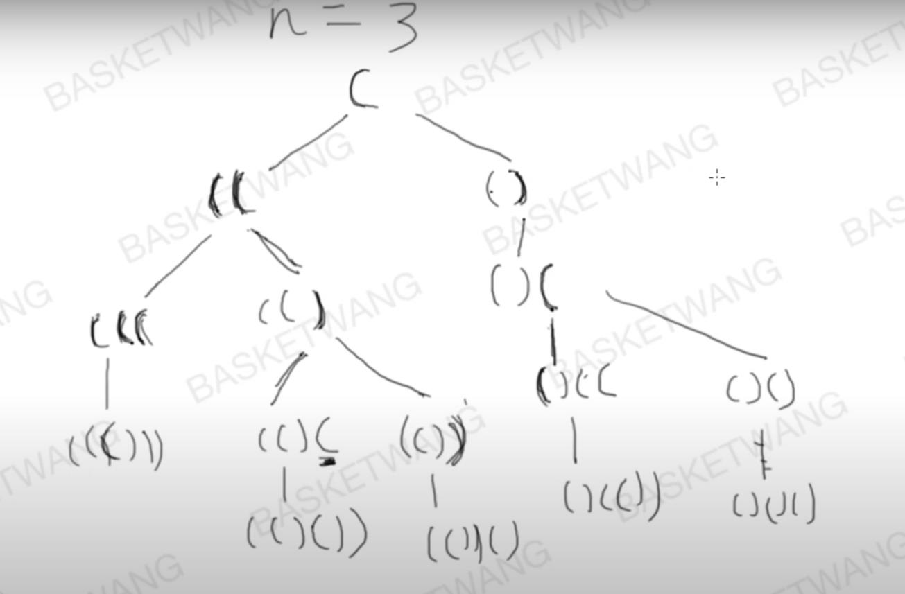
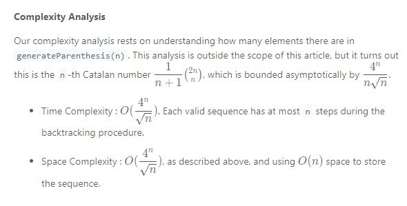
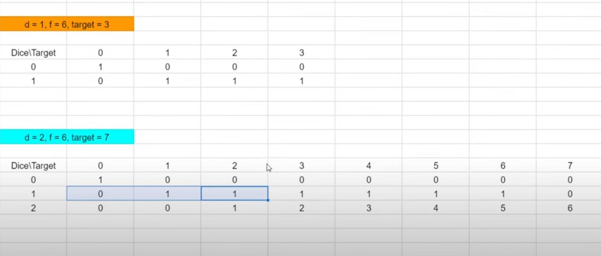
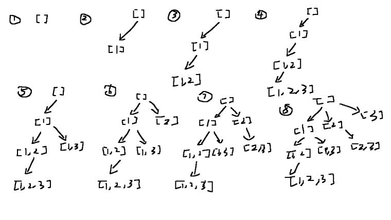
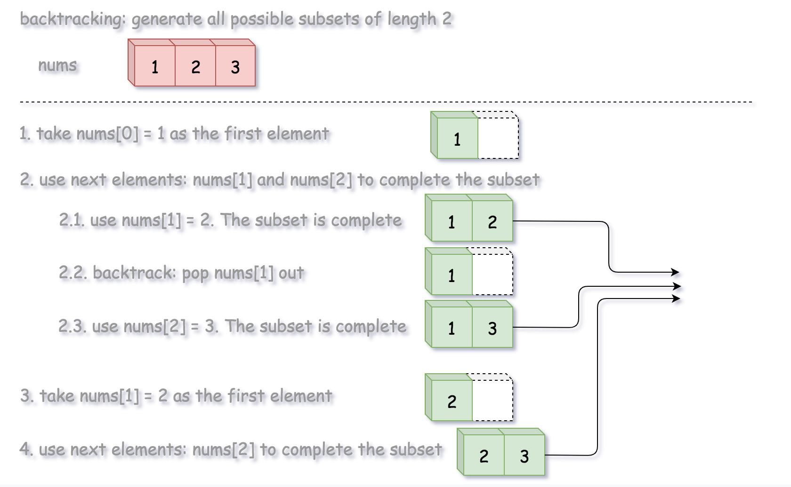

## Table of Contents

- [Table of Contents](#table-of-contents)
- [22. Generate Parentheses](#22-generate-parentheses)
  - [Approach 1: Backtracking](#approach-1-backtracking)
  - [Approach 2: DP](#approach-2-dp)
- [15. 3Sum](#15-3sum)
  - [Approach 1: Two-pointers](#approach-1-two-pointers)
  - [Approach 2: Hashset + two-pointers](#approach-2-hashset--two-pointers)
- [451. Sort Characters By Frequency](#451-sort-characters-by-frequency)
  - [Approach 1: MaxHeap (priority queue)](#approach-1-maxheap-priority-queue)
  - [Approach 2: array indexing](#approach-2-array-indexing)
- [347. Top K Frequent Elements](#347-top-k-frequent-elements)
  - [Approach 1: MaxHeap (priority queue)](#approach-1-maxheap-priority-queue-1)
  - [Approach 2: MinHeap](#approach-2-minheap)
- [1155. Number of Dice Rolls With Target Sum](#1155-number-of-dice-rolls-with-target-sum)
  - [Approach 1: Dynamic Programming](#approach-1-dynamic-programming)
  - [Approach 2: HashMap, recursion](#approach-2-hashmap-recursion)
- [78. Subsets](#78-subsets)
  - [Approach 1: Backtracking](#approach-1-backtracking-1)
- [31. Next Permutation](#31-next-permutation)
  - [Approach 1: smart Math algo](#approach-1-smart-math-algo)
- [2. Add Two Numbers](#2-add-two-numbers)
  - [Approach 1:](#approach-1)
  - [Approach 1:](#approach-1-1)
  - [Approach 1:](#approach-1-2)
  - [Approach 1:](#approach-1-3)
  - [Approach 1:](#approach-1-4)
  - [Approach 1:](#approach-1-5)
  - [Approach 1:](#approach-1-6)
  - [Approach 1:](#approach-1-7)
  - [Approach 1:](#approach-1-8)

## 22. Generate Parentheses

### Approach 1: Backtracking



Complexity Analysis:


```java
class Solution {
    public List<String> generateParenthesis(int n) {
        List<String> ans = new ArrayList<>();
        backtrack(ans, n, 0, 0, "");
        return ans;
    }

    public void backtrack(List<String> ans, int max, int open, int closed, String s) {
        if (max * 2 == s.length()) {
            ans.add(s);

        }
        if (open < max) {
            backtrack(ans, max, open + 1, closed, s + "(");
        }
        if (closed < open) {
            backtrack(ans, max, open, closed + 1, s + ")");
        }
    }
}
```

### Approach 2: DP

First consider how to get the result f(n) from previous result f(0)...f(n-1).
Actually, the result f(n) will be put an extra () pair to f(n-1). Let the "(" always at the first position, to produce a valid result, we can only put ")" in a way that there will be i pairs () inside the extra () and n - 1 - i pairs () outside the extra pair.

Let us consider an example to get clear view:

```
f(0): ""

f(1): "("f(0)")"

f(2): "("f(0)")"f(1), "("f(1)")"

f(3): "("f(0)")"f(2), "("f(1)")"f(1), "("f(2)")"

So f(n) = "("f(0)")"f(n-1) , "("f(1)")"f(n-2) "("f(2)")"f(n-3) ... "("f(i)")"f(n-1-i) ... "(f(n-1)")"
```

```java
public class Solution
{
    public List<String> generateParenthesis(int n)
    {
        List<List<String>> lists = new ArrayList<>();
        lists.add(Collections.singletonList(""));

        for (int i = 1; i <= n; ++i)
        {
            final List<String> list = new ArrayList<>();

            for (int j = 0; j < i; ++j)
            {
                for (final String first : lists.get(j))
                {
                    for (final String second : lists.get(i - 1 - j))
                    {
                        list.add("(" + first + ")" + second);
                    }
                }
            }

            lists.add(list);
        }

        return lists.get(lists.size() - 1);
    }
}
```

## 15. 3Sum

### Approach 1: Two-pointers

for each arr[i], look at the rest of the array to see if there is a pair.

> Idea: [-1,0,1,2,-1,-4]
> Loop through the sorted array,
> Look at -1, check if there are a pair of ints in the rest of the array that addes up to 1, then look at 2, check if there is a pair of ints ....

- Time complexity : O(n^2)
- Space complexity : O(n^2)

```java
 public List<List<Integer>> threeSum(int[] nums) {
        Arrays.sort(nums);
        List<List<Integer>> output = new LinkedList();

        for(int i = 0; i < nums.length - 2; i++){
            if (i == 0 || i > 0 && nums[i] != nums[i-1]){
                int sum = 0 - nums[i];
                int left = i+1;
                int right = nums.length - 1;

                while (left < right){
                    if (nums[left] + nums[right] == sum){
                        output.add(Arrays.asList(nums[i], nums[left], nums[right]));
                        while(left < right && nums[left] == nums[left+1]){
                            left ++;
                        }
                        while(left < right && nums[right] == nums[right-1]){
                            right --;
                        }
                        left ++;
                        right --;
                    }else if(nums[left] + nums[right] > sum){
                        right --;
                    }else{
                        left ++;
                    }
                }
            }
        }
        return output;
    }
```

### Approach 2: Hashset + two-pointers

```java

class Solution {
    public List<List<Integer>> threeSum(int[] nums) {
        Set<List<Integer>> set = new HashSet<>();
        if(nums.length == 0){
            return new ArrayList<>(set);
        }
        Arrays.sort(nums);

        for(int i = 0; i < nums.length; i ++){
            int left = i+1, right = nums.length - 1;
            while (left < right){
                int sum = nums[i] + nums[right]+nums[left];
                if (sum == 0){
                    set.add(Arrays.asList(nums[i], nums[right], nums[left]));
                    left ++;
                    right --;
                }else if (sum < 0){
                    left ++;
                }else if (sum > 0){
                    right --;
                }
            }
        }
        return new ArrayList<>(set);
    }
}
```

## 451. Sort Characters By Frequency

### Approach 1: MaxHeap (priority queue)

- Time: O(n) + K\*log(k)
  - Traverse each character of the string. That is O(n). n is the length of string.
  - Populate the heap with k distinct characters of the string. This klog(k). k is the number of distinct characters of the string. For example, "tree" is k is 3.
  - Append each character of the string. (k distinct characters _ the frequency) . That is O(n).
    So the total time complexity is 2 _ O(n) + K*log(k) = O(n) + K*log(k)
- Space: O(n)

```java
class Solution {
    public String frequencySort(String s) {
        HashMap<Character, Integer> map = new HashMap();
        char[] chars = s.toCharArray();
        for(char c: chars){
            map.put(c, map.getOrDefault(c, 0) + 1);
        }
        //max heap building
        PriorityQueue<Character> maxHeap = new PriorityQueue<>((a, b) -> map.get(b) - map.get(a));
        maxHeap.addAll(map.keySet());
        StringBuilder sb = new StringBuilder();
        //loop through the maxHeap
        while(maxHeap.isEmpty() == false){
            char curr = maxHeap.remove();
            for(int i = 0; i < map.get(curr); i ++){
                sb.append(curr);
            }
        }

        return sb.toString();
    }
}
```

### Approach 2: array indexing

- Build a map of characters to the number of times it occurs in the string
- Create an array where the index of the array represents how many times that character occurred in the String
- Iterate from the end of the array to the beginning, and at each index, append each character to the return string that number of times.
- Time: O(n)

## 347. Top K Frequent Elements

### Approach 1: MaxHeap (priority queue)

use maxHeap. Put entry into maxHeap so we can always poll a number with largest frequency
It is n[log n] because on a worst case if none of element repeat in input, you can have all the elements in heap. so, i.e all the 'n' elements are in the heap.

- Time: `O(NlogK)`, since we do not need to insert to min heap n times, just k times. And poll() is `O(1).`

- Space: `O(n + k)`

```java
class Solution {
    public int[] topKFrequent(int[] nums, int k) {
        Arrays.sort(nums);
        HashMap<Integer, Integer> map = new HashMap();
        for(int i = 0; i < nums.length; i ++){
            map.put(nums[i], map.getOrDefault(nums[i], 0) + 1);
        }

        //max heap
        PriorityQueue<Integer> maxHeap = new PriorityQueue<>((a, b) -> map.get(b) - map.get(a));
        maxHeap.addAll(map.keySet());

        int[]output = new int[k];
        while(!maxHeap.isEmpty() && k - 1 >= 0){
            int curr = maxHeap.remove();
            output[k-1] = curr; //k-1 -> 0
            k--;
        }
        return output;
    }
}
```

### Approach 2: MinHeap

so that the heap size can be maintained <= k.

```java
  public List<Integer> topKFrequent(int[] nums, int k) {
        Map<Integer, Integer> map = new HashMap<>();
        for(int n: nums){
            map.put(n, map.getOrDefault(n,0)+1);
        }

        PriorityQueue<Map.Entry<Integer, Integer>> minHeap =
            new PriorityQueue<>((a, b) -> Integer.compare(a.getValue(), b.getValue()));
        for(Map.Entry<Integer,Integer> entry: map.entrySet()){
            minHeap.add(entry);
            if (minHeap.size() > k) minHeap.poll();
        }

        List<Integer> res = new ArrayList<>();
        while(res.size()<k){
            Map.Entry<Integer, Integer> entry = minHeap.poll();
            res.add(entry.getKey());
        }
        return res;
    }

```

## 1155. Number of Dice Rolls With Target Sum

### Approach 1: Dynamic Programming

> 

- Time complexity: `O(n*k*target)`
- Space complexity:
-

```java

```

### Approach 2: HashMap, recursion

- Time complexity:
- Space complexity:
-

```java

```

## 78. Subsets

### Approach 1: Backtracking

>  > 

- Time complexity:O(2^n), n is size of nums.
  the recursive call where you have index+1 should be i+1; Otherwise there would be duplicates.
- Space complexity: O(n), as the stack goes, the deepest of the stack could go would be the size of nums.

```
We define a backtrack function named backtrack(first, curr) which takes the index of first element to add and a current combination as arguments.

If the current combination is done, we add the combination to the final output.

Otherwise, we iterate over the indexes i from first to the length of the entire sequence n.

Add integer nums[i] into the current combination curr.

Proceed to add more integers into the combination : backtrack(i + 1, curr).

Backtrack by removing nums[i] from curr.

```

```java
public List<List<Integer>> subsets(int[] nums) {
        List<List<Integer>> powerset = new ArrayList<>();
        backtrack(nums, powerset, 0, new ArrayList<Integer>());
        return powerset;
    }
    //generate the powerset of the subset
public void backtrack(int[] nums, List<List<Integer>> powerset, int index, List<Integer> curr){
        powerset.add(new ArrayList<>(curr));
        for(int i = index; i < nums.length; i++ ){
            curr.add(nums[i]);
            backtrack(nums, powerset, i + 1, curr);
            curr.remove(curr.size() - 1);
        }
    }
```

## 31. Next Permutation

### Approach 1: smart Math algo

1. find the first decreasing sequence starting from the end //a[i]a[i] and a[i-1]a[i−1] where, a[i] > a[i-1]a[i]>a[i−1]
2. find the the number which is just larger than itself among the numbers lying to its right section, say a[j], for substitution and perform swap
3. rearrange remaning array by reversing it

- Time complexity: O(n)
- Space complexity: O(1)

> Note: 1) to find the first decreasing element, it has to be `first >= 0 && nums[first] >= nums[first+1]`, so that we keep on looping when nums[first] is greater than or equal to nums[first+1]
>
> 2. Note that to find the next largest one in the rest of the decreasing array, we keep on looping whenever nums[justLargest] <= nums[first]

```java
class Solution {
    public void nextPermutation(int[] nums) {
        int first = nums.length - 2;
        while (first >= 0 && nums[first] >= nums[first+1]){
            first --;
        }
        if (first >= 0){
            int justLargest = nums.length - 1;
            while (justLargest >= 0 && nums[justLargest] <= nums[first]){
                justLargest --;
            }
            swap (nums, justLargest, first);
        }
        //rearrange the remaning array by reversing it
        reverse(nums, first + 1);
    }
    public void swap(int[] nums, int i, int j){
        int temp = nums[i];
        nums[i] = nums[j];
        nums[j] = temp;
    }
    public void reverse(int[] nums, int start){
        int end = nums.length - 1;
        while (start < end){
            swap(nums, start, end);
            start ++;
            end --;
        }
    }
}
```

## 2. Add Two Numbers

### Approach 1:

- make a dummy node
- make a curr node pointing to the dummy node
- define carry to be 0
- while l1 is not null or l2 is not null,
  - if l1 is null, sum += l2.val + carry, and move l2 to next
  - if l2 is null, sum += l1.val + carry, and move l1 to next
  - else,
    - we compute sum = l2.val + l1.val + carry, and move both pointers to next
  - compute a node with sum%10 as its value
  - make curr.next pointing to the node
  - compute the carry to be sum/10
  - move curr one pointer foward.
- if ultimately the carry is remained,
- we create a carried node, and make curr.next pointing to it
- return result.next.

> edge cases
> Null lists, lists of unequal length, handle sums involving carries , extra carry value at end

- Time complexity: O(max (N,M))
- Space complexity: O(max (N,M))

```java
public ListNode addTwoNumbers(ListNode l1, ListNode l2) {
        ListNode result = new ListNode(-1);
        ListNode curr = result;
        int carry = 0;


        while (l1 != null || l2 != null){
            int sum = 0;
            if (l1 == null){
                sum += l2.val + carry;
                l2 = l2.next;
            }else if (l2 == null){
                sum += l1.val + carry;
                l1 = l1.next;
            }else{
                sum += l2.val + l1.val + carry;
                l1 = l1.next;
                l2 = l2.next;
            }
            int num = sum%10;
            carry = sum/10;
            curr.next = new ListNode(num);
            curr = curr.next;

        }
        if (carry > 0){
            ListNode carried = new ListNode(carry);
            curr.next = carried;
        }
        return result.next;
    }
```

##

### Approach 1:

>

- Time complexity:
- Space complexity:
-

```java

```

##

### Approach 1:

>

- Time complexity:
- Space complexity:
-

```java

```

##

### Approach 1:

>

- Time complexity:
- Space complexity:
-

```java

```

##

### Approach 1:

>

- Time complexity:
- Space complexity:
-

```java

```

##

### Approach 1:

>

- Time complexity:
- Space complexity:
-

```java

```

##

### Approach 1:

>

- Time complexity:
- Space complexity:
-

```java

```

##

### Approach 1:

>

- Time complexity:
- Space complexity:
-

```java

```

##

### Approach 1:

>

- Time complexity:
- Space complexity:
-

```java

```
