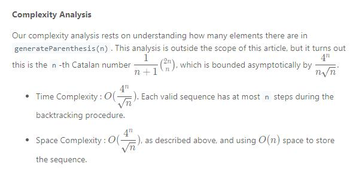

## Table of Contents

- [Table of Contents](#table-of-contents)
- [22. Generate Parentheses](#22-generate-parentheses)
  - [Approach 1: Backtracking](#approach-1-backtracking)
  - [Approach 2: DP](#approach-2-dp)

## 22. Generate Parentheses

### Approach 1: Backtracking


Complexity Analysis:


```java
class Solution {
    public List<String> generateParenthesis(int n) {
        List<String> ans = new ArrayList<>();
        backtrack(ans, n, 0, 0, "");
        return ans;
    }

    public void backtrack(List<String> ans, int max, int open, int closed, String s) {
        if (max * 2 == s.length()) {
            ans.add(s);

        }
        if (open < max) {
            backtrack(ans, max, open + 1, closed, s + "(");
        }
        if (closed < open) {
            backtrack(ans, max, open, closed + 1, s + ")");
        }
    }
}
```

### Approach 2: DP

First consider how to get the result f(n) from previous result f(0)...f(n-1).
Actually, the result f(n) will be put an extra () pair to f(n-1). Let the "(" always at the first position, to produce a valid result, we can only put ")" in a way that there will be i pairs () inside the extra () and n - 1 - i pairs () outside the extra pair.

Let us consider an example to get clear view:

```
f(0): ""

f(1): "("f(0)")"

f(2): "("f(0)")"f(1), "("f(1)")"

f(3): "("f(0)")"f(2), "("f(1)")"f(1), "("f(2)")"

So f(n) = "("f(0)")"f(n-1) , "("f(1)")"f(n-2) "("f(2)")"f(n-3) ... "("f(i)")"f(n-1-i) ... "(f(n-1)")"
```

```java
public class Solution
{
    public List<String> generateParenthesis(int n)
    {
        List<List<String>> lists = new ArrayList<>();
        lists.add(Collections.singletonList(""));

        for (int i = 1; i <= n; ++i)
        {
            final List<String> list = new ArrayList<>();

            for (int j = 0; j < i; ++j)
            {
                for (final String first : lists.get(j))
                {
                    for (final String second : lists.get(i - 1 - j))
                    {
                        list.add("(" + first + ")" + second);
                    }
                }
            }

            lists.add(list);
        }

        return lists.get(lists.size() - 1);
    }
}
```

##

Approach 1:

```java

```

##

Approach 1:

```java

```

##

Approach 1:

```java

```

##

Approach 1:

```java

```

##

Approach 1:

```java

```

##

Approach 1:

```java

```

##

Approach 1:

```java

```

##

Approach 1:

```java

```

##

Approach 1:

```java

```

##

Approach 1:

```java

```

##

Approach 1:

```java

```

##

Approach 1:

```java

```

##

Approach 1:

```java

```

##

Approach 1:

```java

```

##

Approach 1:

```java

```

##

Approach 1:

```java

```

##

Approach 1:

```java

```
