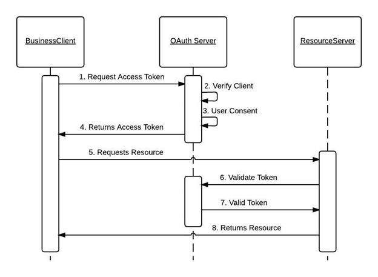

## Why BS?

- I want to build software that empowers the infrastructure of people's daily life, from constructions, to
- My friend Yixuan who worked at BS during summer 2021 had received amazing mentorship.
- He told me he was working on the Simulacra team to redesign the destributed system in C# to make the software more scalable. He also restructured the in-memory data management system for faster querying and and lighter memory usage. Optimizing clustering algorithms for the “rendering physical items on the map” feature to run 1000x faster.

Tech stacks:

- C#
- Rabbit MQ

  > RabbitMQ is a messaging broker - an intermediary for messaging. It gives your applications a common platform to send and receive messages, and your messages a safe place to live until received.

- Oil, gas, construction and infrastructure industry.
- Took initiative to design Microfrontends architecture to extend existing product in a scalable, and maintainable way.
- a commercial Design Review and Commenting software

## Resume Walkthrough

## Coursework: dropped operating systems, it was supposed to be taken in FA22

## Experience

write down my thinking process
说一些 take notes, retrospective

### PINT,Inc

- Internship logistics
  - I have 2 mentors, one full-time software engineer, and the product manager of my team.
  -
- How's a day like in my internship

  - I tend to ship as much as possible in the morning when I am the most focused.

- Challenges that I faced
  - Ambiguity between "client" and "user"
  - I directly communicate with the stakeholders (our paying clients). We receive requirements and feedback directly from them. We do what they want us to do. However, they are not the major audience of the products.
  - we have to adhere to their demands, while sometimes their requirements might not always be taking the users' experience into consideration.
    - For instance, in building this one site whose audience group are patients with Glaucoma, optimizing the usability for vision-impaired users is the number one thing to do.
    - Eg. Elevating the product’s screen reader experience by color contrasting, image optimization, and better flexibility in both mobile and desktop, etc.
- What are some feedbacks you have received after the internship:

  - Talk in a more confident, business-like, and client facing way

- how did i build the server side using golang
  - I implemented basic web server functionality, listen for connections on a socket,
  - Clients connect to this socket, and use the HTTP protocol to retrieve files from the server
  - My server read data from the client, using framing and parsing techniques to interpret one or more requests (if the client is using pipelined requests)
  - My server was implemented in a concurrent manner, so that it can process multiple client requests overlapping in time.
- Why using web components with Vanilla JS? Which web components did you build?
  - Pop up modal, grid, product page card, main app.js component, form and table component
- What's the user group for the web app? What features does it include? What features have you built?
  - People with Glaukoma desease.
  - Dashboard of searching for the clinics nearest clinic that are using the particular medical device
- Docker and Kubernete? How did you use them in deploying?
- How did you reduce response time of the RESTful APIs by 60%?

### humanID

- How does the SSO work? delete user's phone number right after the authentication?
  - hasing of users data
  - creates a non-reversible identifier from a unique phone number
  - Pseudonymous identifier cannot be traced back to phone number, even by humanID
    - humanID provides platforms with 2nd payer psuedonymous SubIDs, unique by user and platform
- How does the OAuth2 architecture work?
- 
  > Interaction between the business Client, OAuth Server and resource server
  - first, the user accesses the resources using the client application,
  - Then the client app gives client id and password to login via humanID
  - Then User logs into client app via Amazon, , etc
  - Redirects users with URI and authentication code
  - User accesses the page located at redirct URI
  - Client application sends auth code, client ID and password to authorization server,
  - Authentication application returns an access token
  - User logs in and access the resources of resource owner
- How did you ship the payment platform from prototype with stripe integration?
- 1. Online payment 2) Subscription
-

### Google CSRMP

- How's the research experience like?
  - I got assigned into a pod with a fellow MSCS student and a PhD student, and 3 of us were mentored by a Research Scientist at Google, Dr. Stephen Tu.
  - I also had a mentor at school who's a first year phd student at UCSD Math Department.
- Field of research I got invovled in?
  - Using functional programming methods to examine and explore theories
- algebraic geometry? Category theory and quantum computing
- Difference between this experience and other ones?
  - in a SWE internhsips, there are deadlines where I'm pushed to

### Undergraduate TA

### Slack for WIC

- Bcrypt algo in Node.js
- login authentication
- direct messages
- group chats
- reactions
- ability to edit and deleted messages
-

### San Diego Zoo Seeker

- implemented dijkstra to obtain the shortest path between current location and destination.
- search interface, voices search seeral UIs
- observer and adapter pattern

### Official website for fanfan

- MVP delivery in 6 weeks through prioritization
- 1000+ daily activer users for menu browsing, online ordering, rewards program, client feedback
- 120% in daily active users within the first month after launching the MVP.

### Tech stacks

MongoDB, AWS, Vue3, docker, postman, expressJS, NodeJS, GO,

### TripleC PM chair

## Problem 1:

1.  When building the palindrome, you can rearrange the remaining letters in
    any way.

- Time: O(Max between n and 26)
- Space: O(unique chars in the str)

> algo walkthrough:
>
> - Make a frequency table of size 26, where each frequency[i] will be storing the occurence of the ith character in the string
> - Loop through the string, make the frequency table
> - loop through the frequency table (0 to 25), count number of characters with odd frequency
> - because in a palindrome, we could only allow 0 or 1 character with odd frequency:
>   - eg. aabaa has 1 character with odd frequency
>   - eg. aabbaa has 0 character with odd frequency
>   - eg. aabaac cannot be come a palindrome
> - any string with >= 2 odd frequency characters CANNOT form a palindrome!!!
> - Therefore, we will return 0 if count == 0 or count == 1
> - Otherwise, we will be returning count - 1.
>   - at this stage, we either return count or count - 1 would ACHIEVE OUR GOAL!
>   - Since we are looking for the MINIMUM number of characters to be removed from the original string,
>   - we return count - 1, since it's smaller than count.

```java
class Solution {
    public int solution(String S) {
        //minimum number to be removed in order to build a palindrome
        int n = S.length();
        int[] frequency = new int[26];
        for(int i = 0; i < n; i ++){
            frequency[s.CharAt(i) - 'a'] ++;
        }
        //count the number of characters with odd frequency
        int count = 0;
        for(int i = 0; i < 26; i ++){
            if (frequency[i] %2 == 1){
                count ++;
            }
        }
        if (count == 0|| count == 1){
            return 0;
        }else{
            return count - 1;
        }
    }
}
```

## Problem 2

Given an array A consisting of strings, your function should calculate the length of the longest string S such that:

- S is a concatenation of some of the strings from A;
- every letter in S is different.

- Time: `O(n\*2^n)` N = number of elements in arr
- Space: `O(n\*2^n)`

> Algo walk through:
>
> - make a global variable result, because we are going to use it in multiple methods
> - check edge cases:
>   - arr == null
>   - arr.size() == 0
> - return 0
> - we proceed with the dfs method
> - DFS function: `dfs(List<String>arr, String path, int index)`
>   - first, update the result!
>     - check if the path has unique character. if so, we get the maximum between path.length() and result.
>   - return if index == arr.size() or doesn't have unique chars
>   - loop from index to the rest of the array
>   - perform the reursion using dfs, but with
>     - `path+arr.get(i)`
>     - `i+1`
> - about the `isUniqueChars` function,
>   - Make a HashSet,
>   - check if hashset already contains the character.
>     - if not, we return false.
>     - if does, we add it to our set.
>   - return true;

```java
class Solution{
    private int output = 0;

    private int solution(String[] A){
        //check the edge cases:
        if (A == null || A.length == 0){
            return 0;
        }
        dfs(A, "", 0);
        return output;
    }

    private void dfs(String[] arr, String path, int index){
        boolean isUnique = uniquechars(path);
        if (isUnique){
            output = Math.max(path.length(), output);
        }
        if (index == arr.size() || !isUnique){
            return;
        }
        // for each string in arr
        for(int i = index; i < arr.size(); i ++){
            // try subsequent strings in arr
            dfs(arr,path+arr.get(i), i + 1);
        }
    }

    private boolean isUnique(String s){
        Set<Character> set = new HashSet<>();
        for(char c: s.toCharArray()){
            if (set.contains(c)){
                return false;
            }else{
                set.add(c);
            }
        }
        return true;
    }
}

```

7, 10 20 30 70
